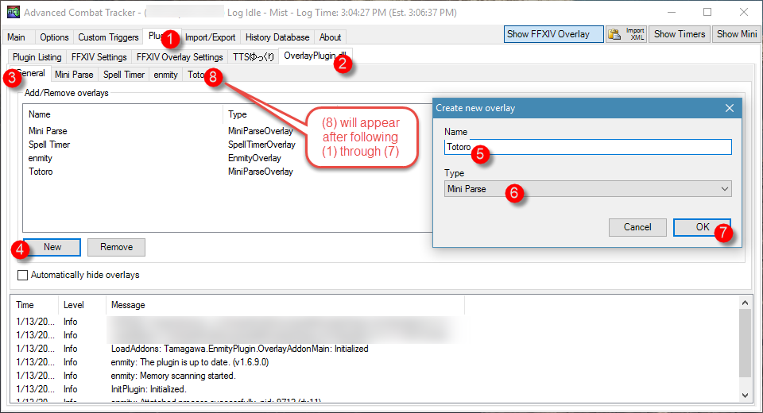
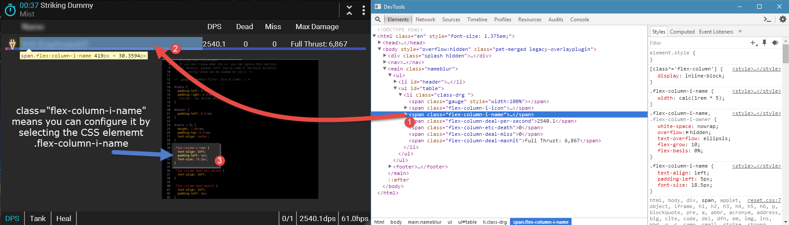

# gh-hosting

Hosting images for master-branch's reference.

Figure 1. ACT settings

Figure 2. How to add Kagerou skin to a new Mini Parse overlay

Figure 3. How to use DevTools and Custom CSS to modify Kagerou elements
